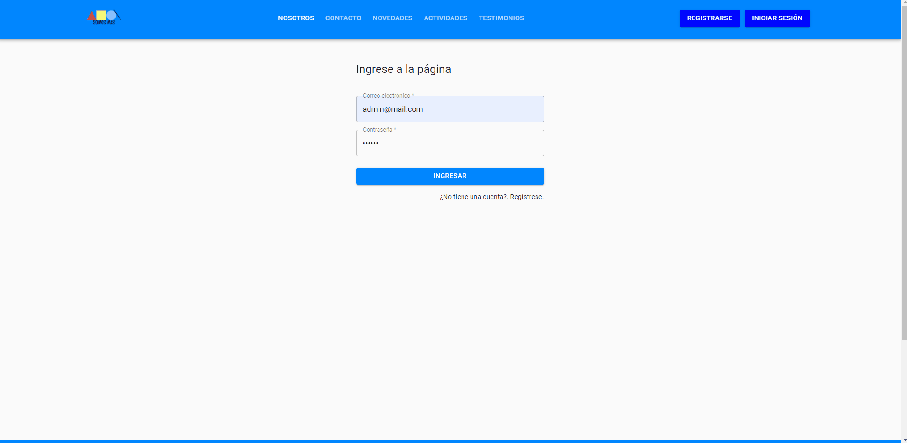
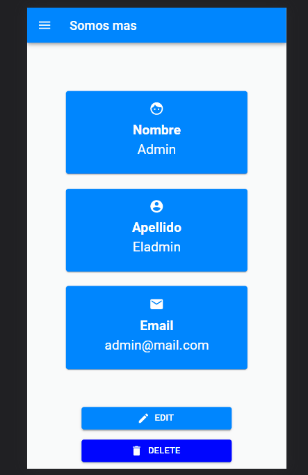

<h2 align="center">
  Proyecto Final Alkemy
</h2>

----

## Tabla de Contenido - Index

1. [¿Qué es esto?](#what)
2. [Explicación en Profundidad](#deep)
3. [Tecnologías Utilizadas](#tech)
4. [Demostración](#demo)
5. [Licencia](#license)

----

### ¿Qué es esto? 

Proyecto final, realizado en conjunto con más de 10 personas. Entre compañeros, mentores, coordinares, seniors de la industria.

La cual es una aplicación web destinada a la autogestión de una ONG ficticia llamada Somos Más.

----

### Explicación en Profundidad 

Durante la aceleración de Alkemy, participe en el desarrollo de esta página web cuyo objetivo es el de ofrecer una solución de autogestión de su web a una ONG, para que pueda mantener informados a sus usuarios sobre noticias y actividades, que conozcan más sobre la organización y darles la capacidad de contactarse con ellos.
También, darles la posibilidad a los administradores de tener las herramientas necesarias para gestionarla, de forma cómoda e intuitiva.

El proyecto propuesto por Alkemy, es de carácter integral, donde en un grupo de tamaño medio, compuesto entre otros de juniors y seniors, además de coordinadores, analista funcional, entre otros. Trabajando de manera formal como se hace en la industria. Completando dailys, sprints, retros, etc. en la modalidad Scrum.

Mostrando un proyecto final, acabado, testeado y funcionado. A un grupo de personas, simulando una demostración del producto a un cliente final.

----

### Técnologías Utilizadas 

#### Frontend
- React
- Redux
- Material Ui
- Prettier
- Formik
- CKEditor
- React Router
- Framer Motion
- Jest

#### Backend
- Express
- Sequelize
- MySql
- SQLite
- SendGrid
- AWS S3
- JWT
- Bcrypt
- Joi
- Morgan
- Winston
- Prettier
- Jest
- Supertest

----

### Demostración 

Podrán observar el código clonando directamente el proyecto.

Lamentrablemente para hacerlo funcionar, deberán contar con credenciales disponibles para AWS S3 y SendGrid.

Pero aquí les dejo unas imagenes/gift del proyecto funcionando.

##### Recorrido del Home:

##### Recorrido del BackOffice para los usuarios administradores:

##### Home desde un dispositivo Mobil:

##### BackOffice desde un dispositivo Mobil:

----

##### Licencia 

[Licencia Github](LICENSE)